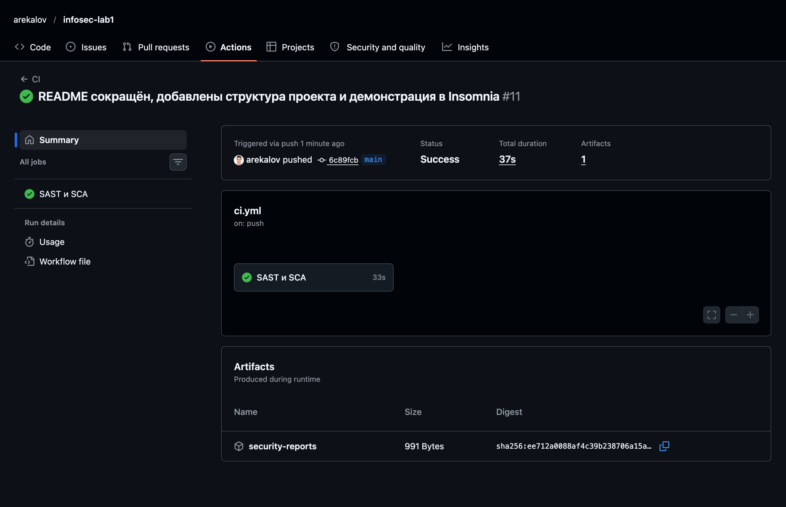
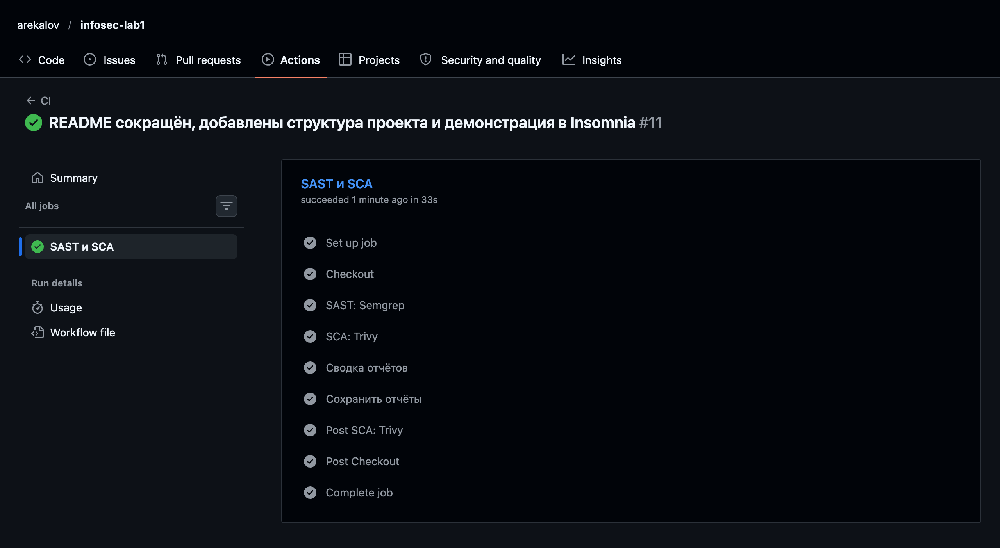
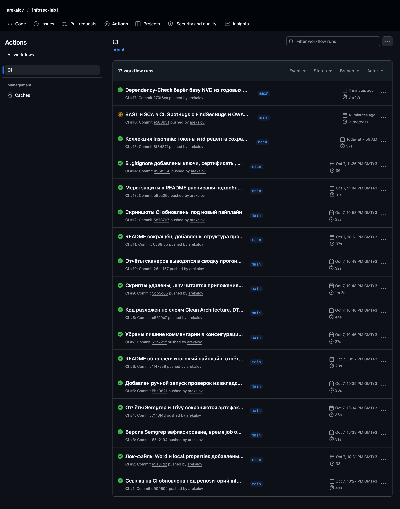

# Recipe API

REST API для хранения кулинарных рецептов.

Каждый пользователь работает только со своими рецептами. Доступ к данным — по JWT-токену,
выданному после входа.

## API

Публичны только `/auth/register` и `/auth/login`. Остальное требует заголовок
`Authorization: Bearer <token>`.

| Метод | Путь | Доступ | Назначение |
|---|---|---|---|
| `POST` | `/auth/register` | открыт | Регистрация: `{username, password}` |
| `POST` | `/auth/login` | открыт | Вход, выдача JWT |
| `GET` | `/api/data` | JWT | Список своих рецептов; `?q=`, `?page=`, `?size=` |
| `POST` | `/api/recipes` | JWT | Создать рецепт |
| `GET` | `/api/recipes/{id}` | JWT + владелец | Прочитать рецепт |
| `PUT` | `/api/recipes/{id}` | JWT + владелец | Обновить рецепт |
| `DELETE` | `/api/recipes/{id}` | JWT + владелец | Удалить рецепт |

## Меры защиты

### SQL-инъекции (OWASP A03)

Все обращения к базе идут через Spring Data JPA, SQL из строк нигде не склеивается.
Простые выборки описаны derived-методами, например `findByIdAndOwnerUsername`: Spring Data
строит по имени метода параметризованный запрос. Поиск по названию написан на JPQL
с именованными параметрами:

```kotlin
@Query("""
    SELECT r FROM Recipe r
    WHERE r.owner.username = :username
      AND LOWER(r.title) LIKE LOWER(CONCAT('%', :query, '%'))
""")
fun search(@Param("username") username: String, @Param("query") query: String, pageable: Pageable): Page<Recipe>
```

Значения `:username` и `:query` уходят в JDBC как параметры `PreparedStatement` и не становятся
частью текста запроса. Поэтому поиск по строке `' OR '1'='1` возвращает пустой список,
а не все рецепты.

Код: [`SpringDataRecipeRepository.kt`](src/main/kotlin/ru/itmo/infosec/recipes/infrastructure/persistence/SpringDataRecipeRepository.kt).

### XSS (OWASP A03)

Защита построена в три слоя.

1. **Экранирование на выходе.** Каждое текстовое поле рецепта перед отправкой проходит через
   OWASP Java Encoder, поэтому `<script>` возвращается клиенту как `&lt;script&gt;`:
   ```kotlin
   title = Encode.forHtml(title),
   description = Encode.forHtml(description),
   ingredients = ingredients.map(Encode::forHtml),
   ```
2. **Проверка на входе.** Bean Validation ограничивает длину полей рецепта, а логин может
   содержать только латиницу, цифры и `_ . -`. Запрос, не прошедший проверку, получает 400.
3. **Заголовки ответа.** Spring Security добавляет `X-Content-Type-Options: nosniff`,
   `X-Frame-Options: DENY`, `Content-Security-Policy: default-src 'none'; frame-ancestors 'none'`
   и `Referrer-Policy: no-referrer`. Даже открытый в браузере ответ не исполнит скрипты
   и не встроится во фрейм.

Код: [`RecipeMapper.kt`](src/main/kotlin/ru/itmo/infosec/recipes/presentation/mapper/RecipeMapper.kt),
[`RecipeRequest.kt`](src/main/kotlin/ru/itmo/infosec/recipes/presentation/dto/RecipeRequest.kt),
[`SecurityConfig.kt`](src/main/kotlin/ru/itmo/infosec/recipes/infrastructure/security/SecurityConfig.kt).

### Хранение паролей (OWASP A07)

Пароли хешируются bcrypt с cost 12, то есть 2¹² раундов. Соль генерируется для каждого
пароля и хранится внутри хеша, поэтому одинаковые пароли дают разные хеши. В базе лежит
только 60-символьный хеш, открытый пароль нигде не сохраняется и не логируется. Минимальная
длина пароля 12 символов.

Код: [`BCryptPasswordHasher.kt`](src/main/kotlin/ru/itmo/infosec/recipes/infrastructure/security/BCryptPasswordHasher.kt),
[`SecurityConfig.kt`](src/main/kotlin/ru/itmo/infosec/recipes/infrastructure/security/SecurityConfig.kt).

### Аутентификация по JWT (OWASP A07)

1. **Выдача токена.** `POST /auth/login` сверяет пароль с хешем и выдаёт JWT, подписанный
   HS256. В токене логин (`sub`), роли, издатель, время выдачи и срок действия 15 минут.
2. **Ключ подписи.** Ключ берётся только из переменной `JWT_SECRET`, в репозитории его нет.
   Он должен быть в Base64 и не короче 32 байт, иначе приложение не запустится.
3. **Проверка на каждом запросе.** Фильтр `JwtAuthFilter` достаёт токен из заголовка
   `Authorization: Bearer` и проверяет через `NimbusJwtDecoder` подпись, алгоритм и срок.
   Декодер принимает только HS256, поэтому токены с `alg: none` или чужим алгоритмом
   отклоняются. При любой ошибке запрос завершается ответом 401 и до контроллера не доходит.
4. **Правила доступа.** Открыты только `/auth/register` и `/auth/login`, остальные пути требуют
   аутентификации. Сессии выключены, состояние хранится только в токене. CSRF-защита не нужна:
   токен передаётся в заголовке, а не в cookie.

Код: [`JwtTokenProvider.kt`](src/main/kotlin/ru/itmo/infosec/recipes/infrastructure/security/JwtTokenProvider.kt),
[`JwtAuthFilter.kt`](src/main/kotlin/ru/itmo/infosec/recipes/infrastructure/security/JwtAuthFilter.kt),
[`JwtConfig.kt`](src/main/kotlin/ru/itmo/infosec/recipes/infrastructure/security/JwtConfig.kt),
[`JwtProperties.kt`](src/main/kotlin/ru/itmo/infosec/recipes/infrastructure/security/JwtProperties.kt).

### Подбор пароля и перебор логинов (OWASP A07)

После 5 неудачных попыток входа за 5 минут логин блокируется, сервер отвечает 429. Неверный
пароль и несуществующий логин дают одинаковый ответ 401. Для несуществующего логина сервер
всё равно сверяет пароль с bcrypt-заглушкой, поэтому и время ответа не выдаёт, есть ли
такой пользователь.

Код: [`AuthService.kt`](src/main/kotlin/ru/itmo/infosec/recipes/application/service/AuthService.kt),
[`InMemoryLoginAttemptLimiter.kt`](src/main/kotlin/ru/itmo/infosec/recipes/infrastructure/security/InMemoryLoginAttemptLimiter.kt).

### Доступ к чужим данным (OWASP A01)

Каждый запрос к рецептам содержит условие на владельца, а логин владельца берётся из
проверенного токена, а не из тела запроса. На чужой рецепт API отвечает 404, а не 403,
чтобы не раскрывать, что такой рецепт существует.

Код: [`RecipeService.kt`](src/main/kotlin/ru/itmo/infosec/recipes/application/service/RecipeService.kt).

### Утечка внутренних деталей

Ошибки возвращаются в формате RFC 7807: код, обезличенное сообщение и, для ошибок валидации,
список неверных полей. Stacktrace и текст исключений наружу не уходят, они пишутся только в лог.

Код: [`ApiExceptionHandler.kt`](src/main/kotlin/ru/itmo/infosec/recipes/presentation/handler/ApiExceptionHandler.kt),
[`application.yml`](src/main/resources/application.yml).

### Уязвимые зависимости

Версии runtime-зависимостей зафиксированы в `gradle.lockfile`. Tomcat и Jackson подняты выше
версий из BOM Spring Boot, в которых есть известные уязвимости. Веб-консоль H2 отключена.
Каждый push в `main` и pull request проверяется SCA-сканером в CI.

Код: [`build.gradle.kts`](build.gradle.kts).

## CI/CD

| Шаг | Инструмент | Что проверяет |
|---|---|---|
| `SAST: Semgrep` | Semgrep 1.179.0, правила `p/kotlin` `p/java` `p/secrets` | Исходный код и захардкоженные секреты |
| `SCA: Trivy` | Trivy по `gradle.lockfile` | Известные уязвимости зависимостей, включая транзитивные |

Любая находка Semgrep и уязвимость уровня HIGH или CRITICAL у Trivy завершают job с ошибкой.
Отчёты обоих сканеров печатаются в лог job и хранятся 30 дней в артефакте `security-reports`
на странице прогона.

Последний успешный прогон: [Actions → CI](https://github.com/arekalov/infosec-lab1/actions/workflows/ci.yml).






